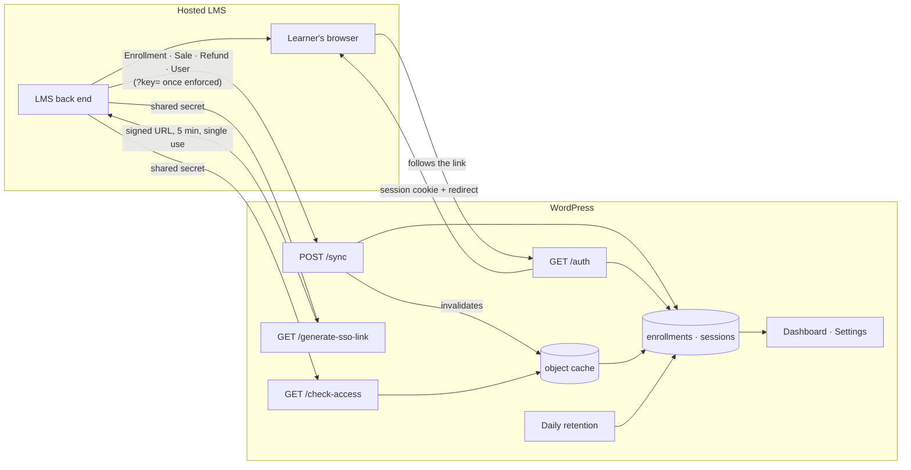

# LMS ↔ WordPress Bridge

[](https://github.com/Furnari-Marco/lms-wordpress-bridge/actions/workflows/tests.yml)

> © 2026 Marco Furnari. **All rights reserved.** Published to be read and reviewed, not reused: see [LICENSE](LICENSE).

A WordPress plugin that shares identity and entitlements with a hosted LMS. Enrollments and sales are mirrored over authenticated webhooks, learners cross from the LMS into WordPress through signed single-use links, and membership checks are answered locally.

## At a glance

**Problem.** A course business sells on a hosted LMS and runs its community and downloads on WordPress. The two platforms share no users and no purchases, so without an integration learners need a second login and access in WordPress has to be kept in step by hand.

**What I built.** This plugin. Purchases and enrollments reach WordPress over authenticated webhooks, learners cross from the LMS with one click through signed single-use links, and access checks are answered locally, without calling the LMS.

**Result.** It ran in production for an online course business: one sign-in for learners, and enrollments, sales and refunds reaching WordPress on their own. The two bugs that production surfaced are fixed and documented in [DECISIONS.md](DECISIONS.md).

## Executive Summary

A business selling courses on a hosted platform almost always runs its community, downloads and marketing on WordPress. The two do not share a user table, an entitlement model or a session, so the seam between them becomes the operator's problem: duplicate logins, manual CSV exports, and members who paid yesterday and cannot open anything today.

This plugin closes that seam. WordPress becomes a trusted mirror of the platform, kept current by webhooks, with single sign-on in one direction and entitlement lookups that never leave the server.

The interesting part is not the happy path. It is what the integration does when the webhook key is rotated, when an event type nobody has seen before arrives, when the same sale is delivered twice, and when the deliveries quietly stop.

## Business Impact

Everything below is in the code and covered by the test-suite.

- **The LMS never sits on the critical path.** `check-access` is answered from the local mirror through the object cache, so a membership check costs one cache read on a warm site and one indexed lookup on a cold one. An outage at the platform does not become an outage on the site.
- **A live integration can be hardened without dropping an event.** Webhook authentication is a staged switch: install, point the platform at the new URL, confirm delivery, then enforce. There is no window in which legitimate events are rejected, which matters because a rejected webhook is not replayed.
- **Re-delivery is safe.** Every handler is an upsert keyed on `(email, course_id)`. The same event arriving twice, which is normal for webhook platforms, converges on the same row rather than duplicating it or resetting fields a later event had already filled.
- **A refund is visible immediately.** The webhook that revokes access also drops the cached answer for that learner, and only for that learner.
- **Silent failure is surfaced.** The most common failure of this kind of integration is that deliveries stop and nobody notices until a customer complains. The dashboard shows when the last event arrived and warns when the feed has gone quiet.
- **67 tests** covering the SSO threat model, every webhook event, cache behaviour and invalidation, retention and the settings screen. The suite executes real SQL against SQLite rather than asserting on query strings.
- **No external dependencies.** Core APIs only: the REST API, `$wpdb`, options, transients, the object cache and cron.

## Tech Stack

`PHP 7.4+` · `WordPress 6.0+` · `MySQL` · the WordPress core APIs. No Composer, no build step, no third-party libraries.

## Architecture



**Sync.** The platform posts JSON to `/sync`. Each event maps to a selective upsert: a re-enrollment never wipes a recorded sale or progress, a sale or refund carrying a course id touches that row only, and one without a course id affects only rows with no price yet, or the most recent paid purchase for a refund. Events the plugin does not recognise are acknowledged with 200, because a 4xx tells the platform the delivery failed and it will retry an event this site will never understand, crowding out the deliveries that matter.

**SSO.** `/generate-sso-link` returns a URL whose HMAC-SHA256 covers the email, a timestamp, a random token *and* the redirect target. `/auth` verifies it in constant time, rejects anything older than five minutes or already used, creates the WordPress user if needed, refuses to authenticate any account that can edit or administer, and redirects through `wp_safe_redirect` with only the site and the LMS whitelisted.

**Entitlements.** `check-access` and the `lwb_current_user_has_course()` template helper read the mirror through the object cache. A negative answer is cached too, so repeated checks for a course somebody has not bought do not each reach the database.

## Security

The threat model is written out in `includes/sso.php`, next to the code that answers it. In summary:

| Threat | Answer |
|---|---|
| Tampering with any signed parameter, redirect included | HMAC covers all of them, compared with `hash_equals` |
| Replaying a captured link | Single-use token, five minute TTL, marked spent for twice that |
| Brute-forcing a token | 128 bits from a CSPRNG, per-IP rate limit on `/auth` |
| Open redirect | Target validated when signed, and again when consumed |
| Forged webhook | Shared key, enforced once the platform has been updated |
| A leaked secret | SSO refuses privileged accounts, so the blast radius is a subscriber session |

**The one risk the code cannot close:** anybody holding the shared secret can mint a sign-in link for any address. `generate-sso-link` must therefore be called from the LMS back end. A front end that calls it from the learner's browser publishes the secret, and no amount of signing survives that. The endpoint cannot tell the difference, so this is stated in the settings screen, in the rollout notes and in the source, rather than defended in code that cannot defend it.

## Rolling it out on a live site

The order matters more than the configuration does.

1. **Install, then set the LMS URL and a fresh shared secret.** Leave *Require webhook key* off. Nothing is exposed yet: without the secret, SSO and entitlement checks stay disabled.
2. **Point the platform's webhook at the URL shown in Settings**, which already carries `?key=`. Save it there.
3. **Confirm delivery.** Create a test enrollment and watch it appear on the dashboard. Until an event has actually arrived, nothing else should be switched on.
4. **Now tick *Require webhook key*.** Doing this before step 3 rejects every delivery until the platform is updated, and those events are gone for good.
5. **Wire SSO from the LMS back end.** Confirm the secret appears in no page source served to a learner.
6. **Backfill.** The mirror only knows what it has been told. Existing enrollments need a one-off import, which is deliberately not part of this plugin: it belongs to whatever export the platform offers.

**Rolling back** is safe at any point: deactivate the plugin. The tables stay, deliveries fail harmlessly, and reactivating picks up where it left off. Schema changes are applied on load rather than on activation, so updating by uploading a zip, which never fires the activation hook, still migrates.

## Performance and operational notes

- **Indexes follow the read paths.** `(user_email, course_id)` is both the entitlement lookup and the upsert key; `user_email` serves the admin view and course-less refunds.
- **The cache group is not made persistent when there is no object cache.** Without one, caching across requests would write to the options table on every miss, which is worse than not caching at all.
- **Retention deletes in batches** of 20 000, at most five statements per run. One unbounded `DELETE` against a table holding years of rows is how a cron job takes a site down at three in the morning.
- **Sign-in records expire, enrollments do not.** Sessions hold an IP and a user agent, so they are personal data with a horizon. Enrollments are the record of a purchase, and deleting one silently revokes access.
- **Known gap: missed deliveries are not reconciled.** If the platform drops a webhook, the mirror stays wrong until a later event for the same learner corrects it. The staleness warning catches a feed that has stopped entirely; it does not catch a single lost event. A periodic reconciliation against the platform's API is the right fix, and is out of scope here.

## Repository layout

```
lms-wordpress-bridge.php   bootstrap: hooks, routes, CORS
includes/
  helpers.php              options, host whitelist, client IP, rate limiting, CORS
  schema.php               tables, and versioned upgrades applied on load
  sso.php                  signed links, /auth, the threat model
  webhook.php              POST /sync event handlers
  access.php               entitlements, object caching, invalidation
  retention.php            batched daily purge
  admin/                   dashboard and settings
tests/                     67 tests over a WordPress stub and real SQL
```

## Running the tests

```
php tests/run.php
```

Needs `pdo_sqlite` and `mbstring`. An optional argument filters by suite name, for example `php tests/run.php sso`.

There is no PHPUnit. `tests/bootstrap.php` stands up a minimal WordPress (options, transients, users, hooks, object cache, REST primitives) and a `$wpdb` adapter over SQLite, so the SQL in the plugin is executed rather than compared against an expected string. The queries are the product; a mock that returns what the test expects proves only that the test agrees with itself.

## Security & IP Note

Architecture Note: This repository showcases the core logical modules and design patterns of the application. For security and intellectual property reasons, proprietary business logic, full frontend implementation, and deployment configurations have been abstracted or removed.

This is the integration layer only. The analytics, reporting and content-protection modules of the system it was extracted from are not part of it, by design rather than by omission.

## License

All rights reserved. See [LICENSE](LICENSE).
